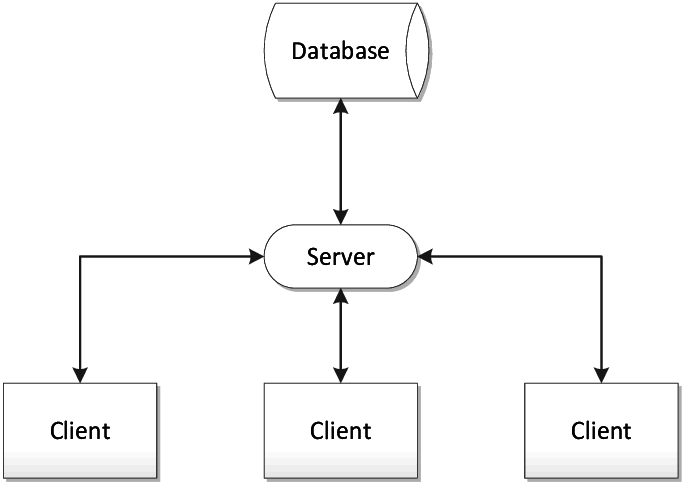

# Basic Web App Configuration

> most web app follow the structure a client, a server and a database

## Client

- define the structure of the webpage(HTML)
- define the look of the webpage(CSS)
- response to user interactions(JavaScript)

## Server

In a web application, the server is like a receptionist that handles requests from the user.
When you create an HTTP server, you assign it to a specific `door number`, which we call a
port number. This 'door number' is always linked to a computer's unique ID, known as an IP address.

Think of ports as different channels on your computer for doing various tasks: one channel
could be for browsing www.facebook.com, and another for getting your email. This is doable
because each of these applications (the web browser and the email client) use different
'door numbers' or port numbers.

After assigning a specific 'door number' to an HTTP server, it waits for user requests
coming to that 'door'. Then, it does the tasks asked by the user, and sends back any requested
data through an HTTP response.

## Database

Databases are like the storage rooms of a website's structure - many of us might find them intimidating,
but they're crucial for a strong base. Simply put, a database is a place where data is kept so it can
be quickly found, organized, and updated.

For instance, if you're creating a social media site, you would use a database to keep track of
information about your users, their posts, and their comments. When a user visits a page, the
information shown on the page is pulled from the website's database. This allows for the immediate
user interactions we're used to on sites like Facebook or apps like Gmail.

## APIs

Communication between different services, and between the server and clients are typically done through an Application Programming Interface, or API. The client will make a request for accessing or modifying a resource, and your server will respond to the client using HTTP. The most common architectural style of APIs on the web is called REST (aka RESTful), which stands for Representational State Transfer. Its main feature is statelessness, which means that servers do not save client data between requests. Client requests to the server are similar to URLs you type in your browser to visit a website, using different methods like GET, PUT, DELETE, etc.

API example : [PokéAPI](https://pokeapi.co/)
