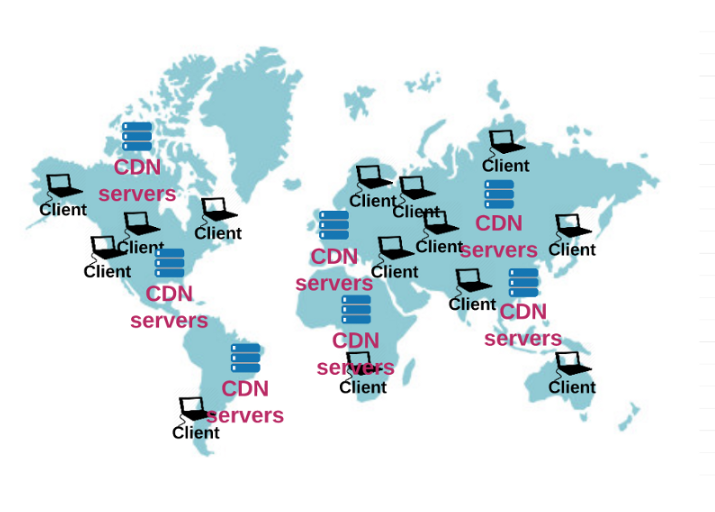

# Basic Web App Configuration

> most web app follow the structure a client, a server and a database

## client

- define the structure of the webpage(HTML)
- define the look of the webpage(CSS)
- response to user interactions(JavaScript)

## server

In a web application, the server is like a receptionist that handles requests from the user.
When you create an HTTP server, you assign it to a specific `door number`, which we call a
port number. This 'door number' is always linked to a computer's unique ID, known as an IP address.

Think of ports as different channels on your computer for doing various tasks: one channel
could be for browsing www.facebook.com, and another for getting your email. This is doable
because each of these applications (the web browser and the email client) use different
'door numbers' or port numbers.

After assigning a specific 'door number' to an HTTP server, it waits for user requests
coming to that 'door'. Then, it does the tasks asked by the user, and sends back any requested
data through an HTTP response.

## database

Databases are like the storage rooms of a website's structure - many of us might find them intimidating,
but they're crucial for a strong base. Simply put, a database is a place where data is kept so it can
be quickly found, organized, and updated.

For instance, if you're creating a social media site, you would use a database to keep track of
information about your users, their posts, and their comments. When a user visits a page, the
information shown on the page is pulled from the website's database. This allows for the immediate
user interactions we're used to on sites like Facebook or apps like Gmail.

## How to Scale a Web Application

For a growing web application, a single server can't manage massive user traffic. To solve this,
incoming traffic can be distributed among multiple servers using a tool called a load balancer.
The load balancer efficiently directs user requests to different servers. This process uses a
Virtual IP address and various algorithms to make routing decisions.

As your application grows, simply duplicating servers won't be sufficient. To manage this, you
can break your server into 'services'. Each service performs a specific task and only interacts
with other servers. This allows for independent scaling and easier project management within teams.
But as you add more servers, managing load balancers, server groups, and services can get challenging.

## Content Delivery Networks

To manage your web application effectively, especially if users are located all around the world,
it's important to ensure fast load times regardless of the distance between the user and the server.
This is where a Content Delivery Network (CDN) comes in handy.

A CDN is a system of "proxy" servers located in various data centers worldwide. These proxy servers
act as middlemen between a user and the main server.

Companies with extensive distributed traffic often use CDNs, like Akamai, to deliver their content
using the CDN's servers. Akamai, for instance, has numerous strategically placed servers worldwide.

When using a CDN, the domain name of a URL directs to the IP address of an edge server owned by the CDN,
like Akamai, rather than the host's server. Akamai then delivers the web content to users, storing copies
of frequently used items such as HTML, CSS, software downloads, and media objects from the main servers.

The main goal of using a CDN is to bring the website's content closer to users, reducing travel distance
for data, leading to lower latency and quicker load times. This results in a faster website experience for the users.

