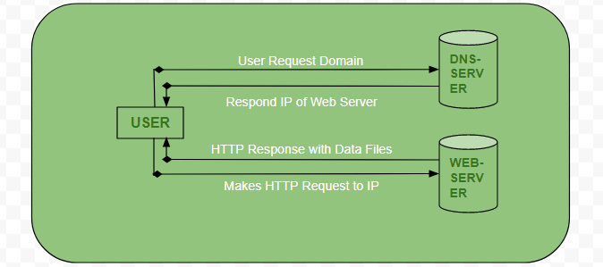

# Client server model

`The Client-Server model`: is a distributed application structure that divides tasks between `servers`, the providers of resources or services, and `clients`, the requesters of these services. When a client sends a request for data to the server over the internet, the server processes the request and delivers the requested data back to the client. Clients and servers operate independently and do not share resources. Examples of this model include Email and the World Wide Web.

In this model, the client refers to a computer capable of receiving information or using a specific service, while the server refers to a remote computer that provides information or access to particular services. Clients make requests, and servers serve the requested information from their databases, establishing a two-way communication between them. This model is fundamental to understanding how the internet works and how web technologies function efficiently.

## How the browser interacts with the servers ?

When you enter a website URL in the browser, the following steps occur to interact with the server:

- User enters the website URL.
- The browser requests the DNS (Domain Name System) server to find the website's IP address.
- The DNS server looks up the IP address of the web server associated with the URL.
- The DNS server responds with the IP address.
- The browser sends an HTTP/HTTPS request to the web server's IP address.
- The web server responds by sending the necessary website files.
- The browser then renders the website using its DOM (Document Object Model) interpreter, CSS interpreter, and JS engine (Just-in-Time compilers) to display the website.

In simple terms, when you type a website URL in the browser, it finds the website's location using the DNS server, requests the files from the web server, and then interprets and displays the website using its rendering engines.

## Advantages of Client-Server model

- Centralized System: All data is stored in a single location, making it easier to manage and access information.

- Cost Efficiency: The model requires less maintenance cost as resources and services are distributed between clients and servers.

- Data Recovery: Since data is centralized, it becomes easier to implement data recovery mechanisms in case of any issues or failures.

- Scalability: The capacity of clients and servers can be adjusted independently, allowing for flexible scaling based on specific needs.

In simple terms, the Client-Server model offers a centralized system that is cost-efficient, facilitates data recovery, and allows for independent scaling of clients and servers.

## Disadvantages of Client-Server model

- Client Vulnerability: Clients can be exposed to viruses, Trojans, and worms if they exist on the server or are uploaded to it.

- Server Vulnerability: Servers are susceptible to Denial of Service (DoS) attacks, which can disrupt their normal operation.

- Data Tampering: During transmission, data packets may be spoofed or modified, compromising the integrity of the information.

- Security Risks: Phishing attacks and Man-in-the-Middle (MITM) attacks are common threats, where login credentials and user information can be intercepted or captured.

In simple terms, the Client-Server model has drawbacks like client vulnerability to malicious software, server susceptibility to DoS attacks, data tampering during transmission, and potential security risks like phishing and MITM attacks.

## Sources

- [geeksforgeeks](https://www.geeksforgeeks.org/client-server-model/)
