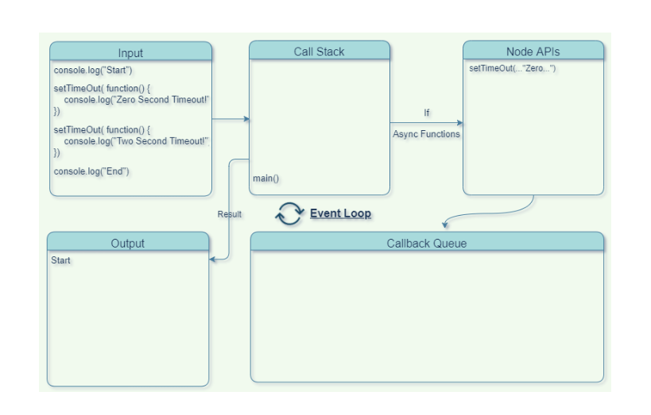

# Understanding the Event Loop in Node.js

## Introduction to Node.js

Node.js is an asynchronous, non-blocking, event-driven JavaScript runtime environment. It is designed to handle high-performance, scalable network applications, making it well-suited for building server-side applications.

## Unraveling the Event Loop

The event loop is at the heart of Node.js' ability to handle asynchronous operations efficiently. It's a fundamental mechanism that allows Node.js to manage various tasks, respond to events, and execute code concurrently without blocking the main thread. Let's dive into how the event loop works with a clear example:

```js
console.log('Start'); // 1

setTimeout(() => {
  console.log('Zero Second TimeOut'); // 3
}, 0);

setTimeout(() => {
  console.log('Two Seconds TimeOut'); // 4
}, 2000);

console.log('End'); // 2
```

Here's a step-by-step breakdown of what's happening:



1. When the program starts, it's wrapped within an anonymous main function, automatically defined by Node.js. This function is pushed onto the callback stack.
2. The first console.log is executed immediately because it's a synchronous operation.
3. The first setTimeout with a delay of "0" is also executed synchronously and then moved to the Node APIs because it's non-blocking.
4. The second setTimeout is treated similarly; it's added to the Node APIs for asynchronous execution.
5. The second console.log is executed, as it's also synchronous.

- Asynchronous functions like setTimeout don't block the main thread. Instead, they are placed in the Node APIs section to execute asynchronously.
- While these functions execute, the main thread continues to execute synchronous operations or tasks from the callback stack.
- Asynchronous functions, when completed, put their callback in the event queue.
- The event loop continuously checks the event queue for callbacks to move them to the callback stack when the main thread is idle.
- Finally, the callbacks are executed one by one, maintaining the order of their arrival in the event queue.

- This is how Node.js achieves efficient multitasking, handling both synchronous and asynchronous operations seamlessly through the event loop. Understanding the event loop is key to writing performant Node.js applications.

## Source

- [freecodecamp](https://www.freecodecamp.org/news/nodejs-eventloop-tutorial/)
